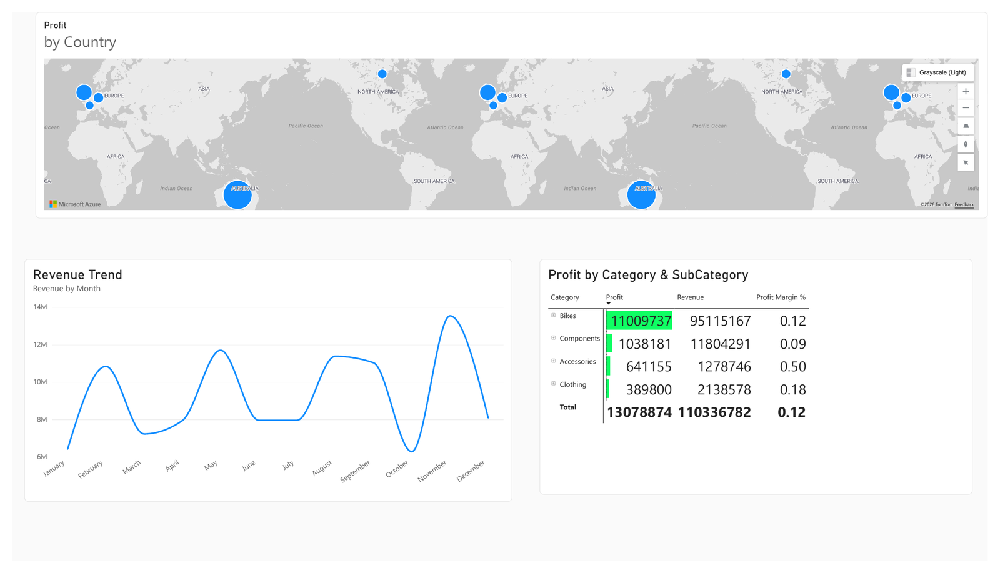
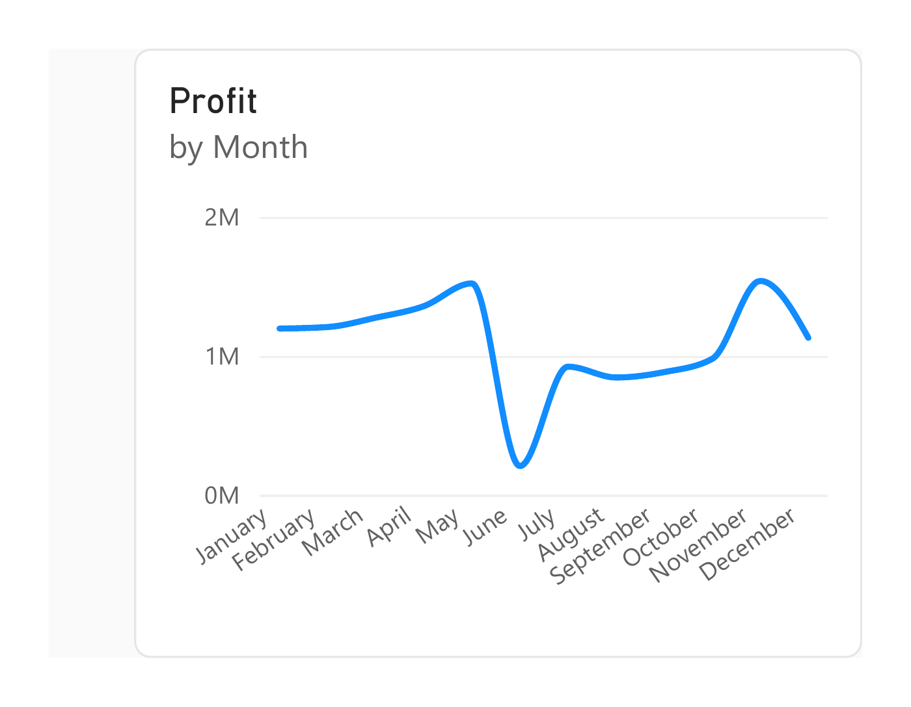
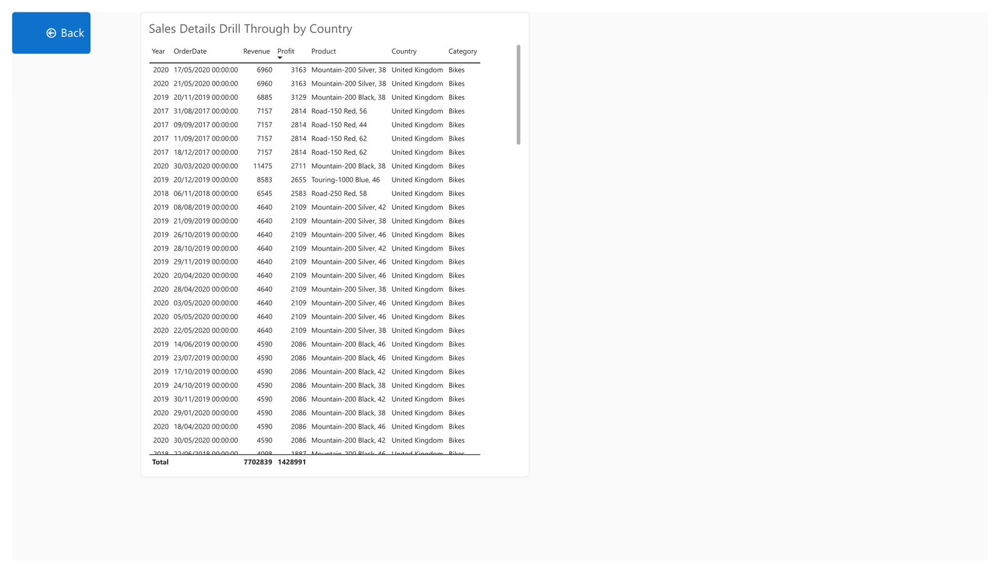
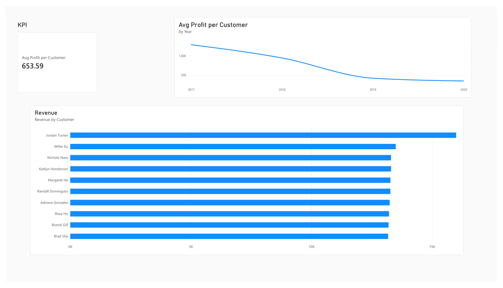
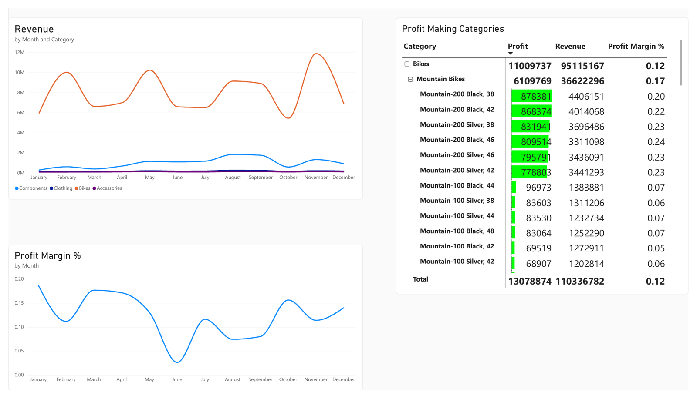

# Dataline Bike Co. — Sales Analytics (Power BI)

An end-to-end Power BI report built for a bike manufacturer, replacing a manual PDF and Excel reporting process with one interactive report for two audiences: executive leadership and the Marketing & Products team.



## Summary

- Four CSV sales files and one multi-sheet Excel workbook cleaned, joined and modelled into a star schema
- 121,253 order lines covering July 2017 to June 2020
- Five report pages: Executive Page, Profit Tooltip, Sales Details (drillthrough), Customer Analysis, Category & Margin Trends
- Revenue, profit and margin measures built in DAX, with time intelligence for year-to-date and year-over-year profit

## Business Problem

Dataline Bike Co. produced its sales reports by hand in PDF and Excel. Two groups needed the same data for different questions:

- **CEO and managers:** which products drive profit or loss in each country, and how revenue is developing over time
- **Marketing & Products:** year-to-date sales, profit versus the previous year, order-level detail, customer analysis, and category and product profitability

## Solution Overview

| Page | Audience | What it does |
|---|---|---|
| Executive Page | CEO / managers | Map of countries sized by profit, revenue trend line, Category → Subcategory → Product matrix with data bars on profit |
| Profit Tooltip | CEO / managers | Report-page tooltip showing monthly profit when hovering a country on the map |
| Sales Details | Marketing & Products | Drillthrough from the map: full order list with date, quantity, revenue, profit, product and country |
| Customer Analysis | Marketing & Products | Average profit per customer (KPI and trend) and top 10 customers by revenue, filtered to Internet orders |
| Category & Margin Trends | Marketing & Products | Revenue by category over time, profit margin trend, and the category/subcategory/product matrix |

## Report Pages

### Executive Page


### Profit Tooltip
Appears when hovering a country on the map.



### Sales Details (drillthrough)


### Customer Analysis


### Category & Margin Trends


## Key Insights

Headline figures (July 2017 – June 2020):

- **Revenue:** £110.3M
- **Profit:** £13.1M
- **Overall margin:** 12%
- **Bikes:** 86% of revenue and 84% of profit

**1. Touring Bikes sell at volume but barely make money**
- Mountain Bikes: 38% of Bikes revenue, 55% of Bikes profit, 17% margin
- Road Bikes: 46% of revenue, 40% of profit, 10% margin
- Touring Bikes: 15% of revenue, 4% of profit, 3% margin
- Next step: establish whether this is a pricing problem or a cost problem before putting marketing budget behind it

**2. Frame pricing limits Components margin**
- Every non-frame component (wheels, cranksets, handlebars, pedals, forks, derailleurs, brakes and others) sits at about 26% margin
- Mountain Frames: 10% margin. Road Frames: 4%. Touring Frames: roughly break-even
- Mountain and Road Frames together are about 73% of Components revenue
- Moving frame pricing or supplier cost partway towards the rest of the category would raise Components profit sharply without any extra volume

**3. Accessories: high margin, under-leveraged**
- About 1% of revenue, 50% margin, close to 5% of total profit
- Bundling and checkout attach-rate are the obvious levers

**4. Profit per customer is falling**
- Average profit per Internet customer across the period: £653.59
- It falls from about £1,290 in 2017 to about £350 in 2020 (the data ends in mid-June 2020)
- Not yet conclusive: it could be customer growth outpacing profit, or existing customers becoming less profitable. Splitting new versus returning customers is the next step

**5. Sales channel is split almost evenly**
- Internet: 60,398 order lines. Reseller: 60,855
- Profit by channel is not yet in the report, and is a natural next addition

## Data Model

Star schema with `Fact_Sales` at the centre and four dimensions: Customer, Product, Territory and a custom date table.

- **Fact table:** Sales2017 to Sales2020 appended into one table of 121,253 rows. The order date arrived as an integer (e.g. 20170707) and was converted to a true date
- **Date dimension:** built with `CALENDAR()`, with Year, MonthNumber, MonthName, MonthYear, Quarter and YearMonth. Marked as the date table and related on `OrderDate`
- **Relationships:** one-to-many from each dimension into `Fact_Sales`
- **Sales channel:** every row has either `CustomerKey = -1` (reseller) or `ResellerKey = -1` (internet). The source workbook also carried an explicit Channel column; it was merged in and validated against the key pattern (they matched on every row) before being adopted

### Core measures

```DAX
Revenue = SUMX(Fact_Sales, Fact_Sales[Order Quantity] * Fact_Sales[Unit Price])

Profit = SUMX(Fact_Sales, Fact_Sales[Order Quantity] * (Fact_Sales[Unit Price] - Fact_Sales[Product Standard Cost]))

Profit Margin % = DIVIDE([Profit], [Revenue], 0)
```

`Unit Price Discount Pct` is zero across the dataset, so it is not included in the revenue calculation.

## Technical Challenge: Chart Axis Sorting

A line chart kept sorting its date axis alphabetically instead of chronologically. Model-level fixes made no difference: rebuilding the sort key as a whole number, checking summarization settings, and re-checking the date relationship and cardinality.

The cause was a per-visual **Sort By** setting that had locked onto profit instead of date, overriding everything in the model. Switching it back fixed the chart immediately.

- Every time-based chart now uses Power BI's native Date Hierarchy drilled to Month, which sorts correctly by default
- Lesson: check the visual's own sort setting before changing anything in the model

## Tools and Techniques

- Power BI Desktop
- Power Query: appending files, type conversion, merging reference tables
- Data modelling: star schema, date dimension, one-to-many relationships
- DAX: `SUMX`, `DIVIDE`, time intelligence (year-to-date, year-over-year)
- Report design: drillthrough, report-page tooltip, matrix with conditional formatting (data bars), Date Hierarchy drilldown

## Repository Contents

```
├── report/        Power BI report (.pbix)
└── screenshots/   Report page images
```

## How to Open

1. Download `report/Dataline_Bike_Co_Sales_Analysis.pbix`
2. Open it in [Power BI Desktop](https://powerbi.microsoft.com/desktop/) (free)

## Data

The report is built on a sample dataset: four yearly sales CSVs plus a reference workbook (product, customer, reseller and sales territory tables). The raw source files are not included in this repository; the data is embedded in the `.pbix` file.

---

**Author:** Ezekiel Ebuetse · [GitHub](https://github.com/datawithezekiel)
